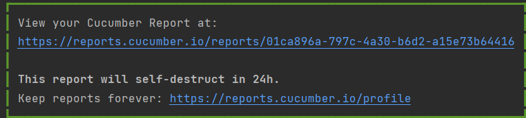

**_Rest API Testing using Rest Assured, Cucumber and JUnit4_**

This is a sample application to demonstrate how to test Rest API using Rest Assured, Cucumber with JUnit4.

This framework consists of:
````
Rest Assured – 5.4.0
Java 17
Cucumber – 7.18.0
JUnit4 - 4.13.2
Maven – 3.9.5
Maven Compiler Plugin - 3.13.0
````

To run the tests through command line, use the command
````
mvn clean test
````
Reports - This framework generates a Cucumber Report.  The location will be mentioned at the end of the test execution as shown in the below image.

